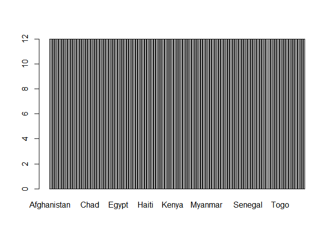
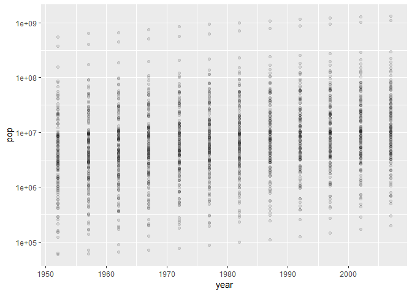
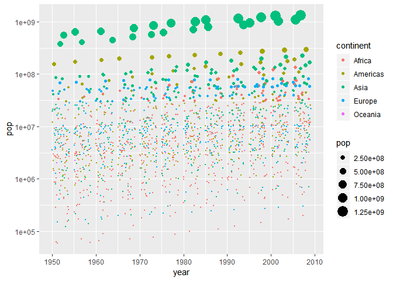
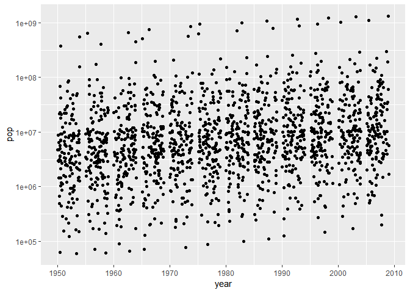
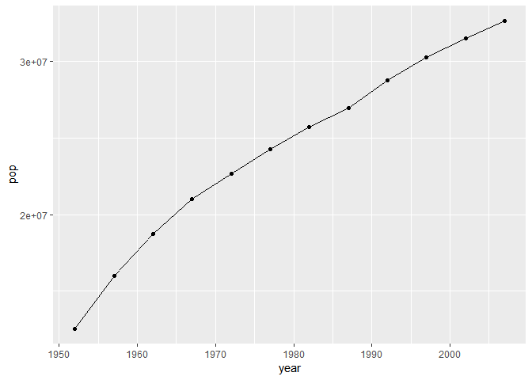
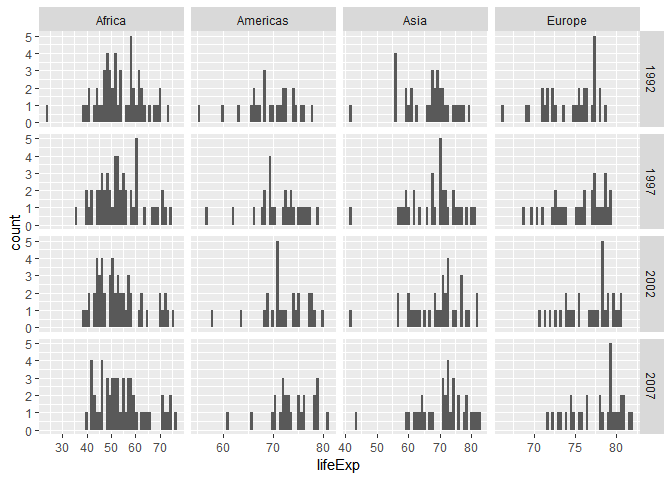
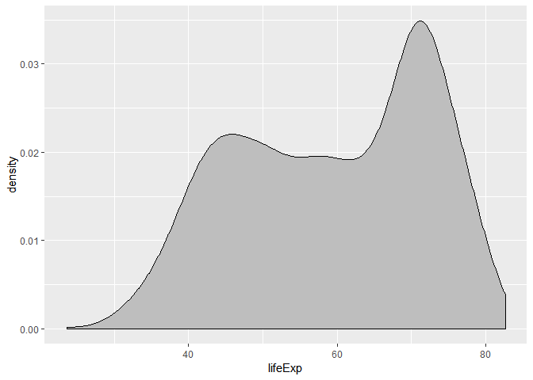
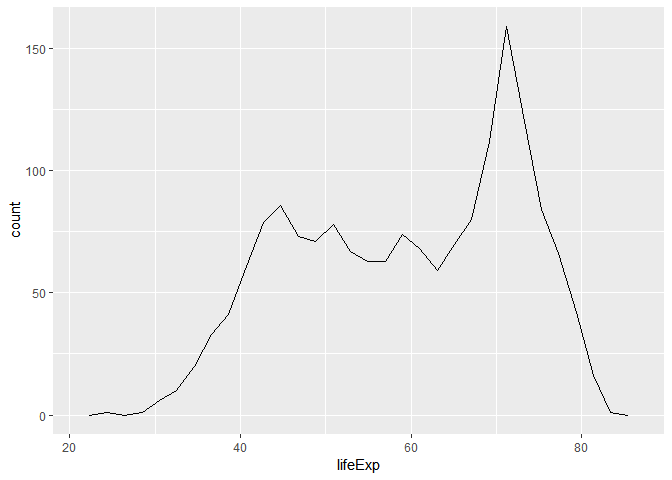
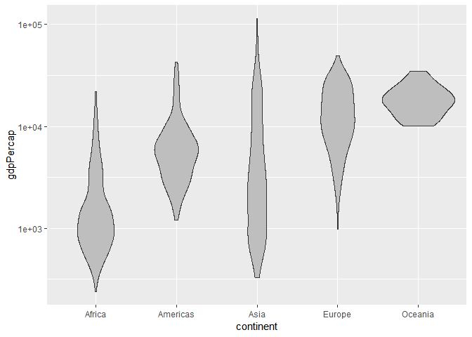

STAT 545A Homework 2
================
Junbin ZHANG
Sept 17, 2018

# Bring rectangular data in

``` r
## load gapminder
library(gapminder)
## load tidyverse
library(tidyverse)
```

    ## -- Attaching packages ------------------------------------- tidyverse 1.2.1 --

    ## v ggplot2 3.0.0     v purrr   0.2.5
    ## v tibble  1.4.2     v dplyr   0.7.6
    ## v tidyr   0.8.1     v stringr 1.3.1
    ## v readr   1.1.1     v forcats 0.3.0

    ## -- Conflicts ---------------------------------------- tidyverse_conflicts() --
    ## x dplyr::filter() masks stats::filter()
    ## x dplyr::lag()    masks stats::lag()

# Smell test the data

## Is it a data.frame, a matrix, a vector, a list?

## What is its class?

``` r
## show the class of the data
class(gapminder)
```

    ## [1] "tbl_df"     "tbl"        "data.frame"

It is a data.frame. It belongs to three classes: tbl\_df, tbl, and
data.frame

## How many variables/columns

``` r
## show the number of columns
ncol(gapminder)
```

    ## [1] 6

## How many rows/observations?

``` r
## show the number of rows
nrow(gapminder)
```

    ## [1] 1704

## Can you get these facts about “extent” or “size” in more than one way? Can you imagine different functions being useful in different contexts?

**For data.frame only**, we can also use `length(gapminder)` to replace
`ncol(gapminder)`. We can also use `dim(gapminder)` to get the numbers
of columns and rows at the same time. To be more complicated,
`str(gapminder)` and `summary(gapminder)` are also possible to
(indirectly) show the numbers of columns and rows

However, for `length()`, as an example, `length()` and `ncol()` will
return different things if the input is a matrix. For the others,
sometimes it may not be necessary to get so much redundant
information.

## What data type is each variable?

``` r
## show the structure of gapminder, which contains data type of each variable
str(gapminder)
```

    ## Classes 'tbl_df', 'tbl' and 'data.frame':    1704 obs. of  6 variables:
    ##  $ country  : Factor w/ 142 levels "Afghanistan",..: 1 1 1 1 1 1 1 1 1 1 ...
    ##  $ continent: Factor w/ 5 levels "Africa","Americas",..: 3 3 3 3 3 3 3 3 3 3 ...
    ##  $ year     : int  1952 1957 1962 1967 1972 1977 1982 1987 1992 1997 ...
    ##  $ lifeExp  : num  28.8 30.3 32 34 36.1 ...
    ##  $ pop      : int  8425333 9240934 10267083 11537966 13079460 14880372 12881816 13867957 16317921 22227415 ...
    ##  $ gdpPercap: num  779 821 853 836 740 ...

There are six variables:

  - “country” as Factor
  - “continent” as Factor
  - “year” as int (Integer)
  - “lifeExp” as num (double)
  - “pop” as int (Integer)
  - “gdpPercap” as num (double)

# Explore individual variables

## Explore categorical variable

There are two categorical variabels: “country” and “continent”. Let’s
explore “country” as a categorical
variable.

### What are possible values (or range, whichever is appropriate) of each variable?

``` r
## print unique values in "country"
unique(gapminder$country)
```

    ##   [1] Afghanistan              Albania                 
    ##   [3] Algeria                  Angola                  
    ##   [5] Argentina                Australia               
    ##   [7] Austria                  Bahrain                 
    ##   [9] Bangladesh               Belgium                 
    ##  [11] Benin                    Bolivia                 
    ##  [13] Bosnia and Herzegovina   Botswana                
    ##  [15] Brazil                   Bulgaria                
    ##  [17] Burkina Faso             Burundi                 
    ##  [19] Cambodia                 Cameroon                
    ##  [21] Canada                   Central African Republic
    ##  [23] Chad                     Chile                   
    ##  [25] China                    Colombia                
    ##  [27] Comoros                  Congo, Dem. Rep.        
    ##  [29] Congo, Rep.              Costa Rica              
    ##  [31] Cote d'Ivoire            Croatia                 
    ##  [33] Cuba                     Czech Republic          
    ##  [35] Denmark                  Djibouti                
    ##  [37] Dominican Republic       Ecuador                 
    ##  [39] Egypt                    El Salvador             
    ##  [41] Equatorial Guinea        Eritrea                 
    ##  [43] Ethiopia                 Finland                 
    ##  [45] France                   Gabon                   
    ##  [47] Gambia                   Germany                 
    ##  [49] Ghana                    Greece                  
    ##  [51] Guatemala                Guinea                  
    ##  [53] Guinea-Bissau            Haiti                   
    ##  [55] Honduras                 Hong Kong, China        
    ##  [57] Hungary                  Iceland                 
    ##  [59] India                    Indonesia               
    ##  [61] Iran                     Iraq                    
    ##  [63] Ireland                  Israel                  
    ##  [65] Italy                    Jamaica                 
    ##  [67] Japan                    Jordan                  
    ##  [69] Kenya                    Korea, Dem. Rep.        
    ##  [71] Korea, Rep.              Kuwait                  
    ##  [73] Lebanon                  Lesotho                 
    ##  [75] Liberia                  Libya                   
    ##  [77] Madagascar               Malawi                  
    ##  [79] Malaysia                 Mali                    
    ##  [81] Mauritania               Mauritius               
    ##  [83] Mexico                   Mongolia                
    ##  [85] Montenegro               Morocco                 
    ##  [87] Mozambique               Myanmar                 
    ##  [89] Namibia                  Nepal                   
    ##  [91] Netherlands              New Zealand             
    ##  [93] Nicaragua                Niger                   
    ##  [95] Nigeria                  Norway                  
    ##  [97] Oman                     Pakistan                
    ##  [99] Panama                   Paraguay                
    ## [101] Peru                     Philippines             
    ## [103] Poland                   Portugal                
    ## [105] Puerto Rico              Reunion                 
    ## [107] Romania                  Rwanda                  
    ## [109] Sao Tome and Principe    Saudi Arabia            
    ## [111] Senegal                  Serbia                  
    ## [113] Sierra Leone             Singapore               
    ## [115] Slovak Republic          Slovenia                
    ## [117] Somalia                  South Africa            
    ## [119] Spain                    Sri Lanka               
    ## [121] Sudan                    Swaziland               
    ## [123] Sweden                   Switzerland             
    ## [125] Syria                    Taiwan                  
    ## [127] Tanzania                 Thailand                
    ## [129] Togo                     Trinidad and Tobago     
    ## [131] Tunisia                  Turkey                  
    ## [133] Uganda                   United Kingdom          
    ## [135] United States            Uruguay                 
    ## [137] Venezuela                Vietnam                 
    ## [139] West Bank and Gaza       Yemen, Rep.             
    ## [141] Zambia                   Zimbabwe                
    ## 142 Levels: Afghanistan Albania Algeria Angola Argentina ... Zimbabwe

It prints out there are 142 unique values in this column, which matches
the fact that there are 142 levels in
“country”

### What values are typical? What’s the spread? What’s the distribution? Etc., tailored to the variable at hand.

``` r
## print the most frequent value(s)
tt <- table(gapminder$country)
names(tt[tt==max(tt)])
```

    ##   [1] "Afghanistan"              "Albania"                 
    ##   [3] "Algeria"                  "Angola"                  
    ##   [5] "Argentina"                "Australia"               
    ##   [7] "Austria"                  "Bahrain"                 
    ##   [9] "Bangladesh"               "Belgium"                 
    ##  [11] "Benin"                    "Bolivia"                 
    ##  [13] "Bosnia and Herzegovina"   "Botswana"                
    ##  [15] "Brazil"                   "Bulgaria"                
    ##  [17] "Burkina Faso"             "Burundi"                 
    ##  [19] "Cambodia"                 "Cameroon"                
    ##  [21] "Canada"                   "Central African Republic"
    ##  [23] "Chad"                     "Chile"                   
    ##  [25] "China"                    "Colombia"                
    ##  [27] "Comoros"                  "Congo, Dem. Rep."        
    ##  [29] "Congo, Rep."              "Costa Rica"              
    ##  [31] "Cote d'Ivoire"            "Croatia"                 
    ##  [33] "Cuba"                     "Czech Republic"          
    ##  [35] "Denmark"                  "Djibouti"                
    ##  [37] "Dominican Republic"       "Ecuador"                 
    ##  [39] "Egypt"                    "El Salvador"             
    ##  [41] "Equatorial Guinea"        "Eritrea"                 
    ##  [43] "Ethiopia"                 "Finland"                 
    ##  [45] "France"                   "Gabon"                   
    ##  [47] "Gambia"                   "Germany"                 
    ##  [49] "Ghana"                    "Greece"                  
    ##  [51] "Guatemala"                "Guinea"                  
    ##  [53] "Guinea-Bissau"            "Haiti"                   
    ##  [55] "Honduras"                 "Hong Kong, China"        
    ##  [57] "Hungary"                  "Iceland"                 
    ##  [59] "India"                    "Indonesia"               
    ##  [61] "Iran"                     "Iraq"                    
    ##  [63] "Ireland"                  "Israel"                  
    ##  [65] "Italy"                    "Jamaica"                 
    ##  [67] "Japan"                    "Jordan"                  
    ##  [69] "Kenya"                    "Korea, Dem. Rep."        
    ##  [71] "Korea, Rep."              "Kuwait"                  
    ##  [73] "Lebanon"                  "Lesotho"                 
    ##  [75] "Liberia"                  "Libya"                   
    ##  [77] "Madagascar"               "Malawi"                  
    ##  [79] "Malaysia"                 "Mali"                    
    ##  [81] "Mauritania"               "Mauritius"               
    ##  [83] "Mexico"                   "Mongolia"                
    ##  [85] "Montenegro"               "Morocco"                 
    ##  [87] "Mozambique"               "Myanmar"                 
    ##  [89] "Namibia"                  "Nepal"                   
    ##  [91] "Netherlands"              "New Zealand"             
    ##  [93] "Nicaragua"                "Niger"                   
    ##  [95] "Nigeria"                  "Norway"                  
    ##  [97] "Oman"                     "Pakistan"                
    ##  [99] "Panama"                   "Paraguay"                
    ## [101] "Peru"                     "Philippines"             
    ## [103] "Poland"                   "Portugal"                
    ## [105] "Puerto Rico"              "Reunion"                 
    ## [107] "Romania"                  "Rwanda"                  
    ## [109] "Sao Tome and Principe"    "Saudi Arabia"            
    ## [111] "Senegal"                  "Serbia"                  
    ## [113] "Sierra Leone"             "Singapore"               
    ## [115] "Slovak Republic"          "Slovenia"                
    ## [117] "Somalia"                  "South Africa"            
    ## [119] "Spain"                    "Sri Lanka"               
    ## [121] "Sudan"                    "Swaziland"               
    ## [123] "Sweden"                   "Switzerland"             
    ## [125] "Syria"                    "Taiwan"                  
    ## [127] "Tanzania"                 "Thailand"                
    ## [129] "Togo"                     "Trinidad and Tobago"     
    ## [131] "Tunisia"                  "Turkey"                  
    ## [133] "Uganda"                   "United Kingdom"          
    ## [135] "United States"            "Uruguay"                 
    ## [137] "Venezuela"                "Vietnam"                 
    ## [139] "West Bank and Gaza"       "Yemen, Rep."             
    ## [141] "Zambia"                   "Zimbabwe"

``` r
## print the frequency of each unique value
summary(gapminder$country)
```

    ##              Afghanistan                  Albania                  Algeria 
    ##                       12                       12                       12 
    ##                   Angola                Argentina                Australia 
    ##                       12                       12                       12 
    ##                  Austria                  Bahrain               Bangladesh 
    ##                       12                       12                       12 
    ##                  Belgium                    Benin                  Bolivia 
    ##                       12                       12                       12 
    ##   Bosnia and Herzegovina                 Botswana                   Brazil 
    ##                       12                       12                       12 
    ##                 Bulgaria             Burkina Faso                  Burundi 
    ##                       12                       12                       12 
    ##                 Cambodia                 Cameroon                   Canada 
    ##                       12                       12                       12 
    ## Central African Republic                     Chad                    Chile 
    ##                       12                       12                       12 
    ##                    China                 Colombia                  Comoros 
    ##                       12                       12                       12 
    ##         Congo, Dem. Rep.              Congo, Rep.               Costa Rica 
    ##                       12                       12                       12 
    ##            Cote d'Ivoire                  Croatia                     Cuba 
    ##                       12                       12                       12 
    ##           Czech Republic                  Denmark                 Djibouti 
    ##                       12                       12                       12 
    ##       Dominican Republic                  Ecuador                    Egypt 
    ##                       12                       12                       12 
    ##              El Salvador        Equatorial Guinea                  Eritrea 
    ##                       12                       12                       12 
    ##                 Ethiopia                  Finland                   France 
    ##                       12                       12                       12 
    ##                    Gabon                   Gambia                  Germany 
    ##                       12                       12                       12 
    ##                    Ghana                   Greece                Guatemala 
    ##                       12                       12                       12 
    ##                   Guinea            Guinea-Bissau                    Haiti 
    ##                       12                       12                       12 
    ##                 Honduras         Hong Kong, China                  Hungary 
    ##                       12                       12                       12 
    ##                  Iceland                    India                Indonesia 
    ##                       12                       12                       12 
    ##                     Iran                     Iraq                  Ireland 
    ##                       12                       12                       12 
    ##                   Israel                    Italy                  Jamaica 
    ##                       12                       12                       12 
    ##                    Japan                   Jordan                    Kenya 
    ##                       12                       12                       12 
    ##         Korea, Dem. Rep.              Korea, Rep.                   Kuwait 
    ##                       12                       12                       12 
    ##                  Lebanon                  Lesotho                  Liberia 
    ##                       12                       12                       12 
    ##                    Libya               Madagascar                   Malawi 
    ##                       12                       12                       12 
    ##                 Malaysia                     Mali               Mauritania 
    ##                       12                       12                       12 
    ##                Mauritius                   Mexico                 Mongolia 
    ##                       12                       12                       12 
    ##               Montenegro                  Morocco               Mozambique 
    ##                       12                       12                       12 
    ##                  Myanmar                  Namibia                    Nepal 
    ##                       12                       12                       12 
    ##              Netherlands              New Zealand                Nicaragua 
    ##                       12                       12                       12 
    ##                    Niger                  Nigeria                   Norway 
    ##                       12                       12                       12 
    ##                     Oman                 Pakistan                   Panama 
    ##                       12                       12                       12 
    ##                  (Other) 
    ##                      516

It seems like every unique value in “country” has the same frequency,
which is 12.

``` r
## print the barplot of each unique value
barplot(table(gapminder$country))
```

<!-- -->

It is not surprise that when we plot the frequency of every unique value
in “country”, each bar appears to be the same.

Therefore, we explore “continent” to check if the R code is correct.

``` r
## print the most frequent value(s)
tt <- table(gapminder$continent)
names(tt[tt==max(tt)])
```

    ## [1] "Africa"

``` r
## print the frequency of each unique value
summary(gapminder$continent)
```

    ##   Africa Americas     Asia   Europe  Oceania 
    ##      624      300      396      360       24

So the most frequent (typical) value in “continent” is “Africa”.

``` r
## print the barplot of each unique value
barplot(table(gapminder$continent))
```

<!-- -->

## Explore quantitative variable

There are four quantitative variabels: “year”, “lifeExp”, “pop” and
“gdpPercap”. Let’s explore “year” as a quantitative
variable.

### What are possible values (or range, whichever is appropriate) of each variable?

``` r
## print the range of "year"
range(gapminder$year)
```

    ## [1] 1952 2007

### What values are typical? What’s the spread? What’s the distribution? Etc., tailored to the variable at hand.

``` r
## print the most frequent value(s)
tt <- table(gapminder$year)
names(tt[tt==max(tt)])
```

    ##  [1] "1952" "1957" "1962" "1967" "1972" "1977" "1982" "1987" "1992" "1997"
    ## [11] "2002" "2007"

``` r
## print the frequency of each unique value
table(gapminder$year)
```

    ## 
    ## 1952 1957 1962 1967 1972 1977 1982 1987 1992 1997 2002 2007 
    ##  142  142  142  142  142  142  142  142  142  142  142  142

It seems like every unique value in “year” has the same frequency, which
is 142.

``` r
## print the barplot of each unique value
barplot(table(gapminder$year))
```

<!-- -->

Again, each bar in the barplot is the same.

Therefore, we explore “lifeExp” to check if the R code is correct.

``` r
## print the most frequent value(s)
tt <- table(gapminder$lifeExp)
names(tt[tt==max(tt)])
```

    ## [1] "69.39"

``` r
## print the frequency of each unique value
table(gapminder$lifeExp)
```

    ## 
    ##   23.599   28.801       30   30.015   30.331   30.332    31.22   31.286 
    ##        1        1        1        1        1        1        1        1 
    ##    31.57   31.975   31.997   31.999   32.065     32.5   32.548   32.767 
    ##        1        1        1        1        1        1        1        1 
    ##   32.978   33.489   33.609   33.685   33.779   33.896    33.97       34 
    ##        1        1        1        1        1        1        1        1 
    ##    34.02   34.078   34.113   34.482   34.488   34.558   34.812   34.906 
    ##        1        1        1        1        1        1        1        1 
    ##   34.977    35.18   35.307     35.4   35.463   35.492   35.753   35.857 
    ##        1        1        1        1        1        1        1        1 
    ##   35.928   35.983   35.985   36.087   36.088   36.157   36.161   36.256 
    ##        1        1        1        1        1        1        1        1 
    ##   36.319   36.324   36.486   36.667   36.681   36.788   36.936   36.981 
    ##        1        1        1        1        1        1        1        1 
    ##   36.984   37.003   37.197   37.207   37.278   37.328   37.373   37.444 
    ##        1        1        1        1        1        1        1        1 
    ##   37.464   37.465   37.468   37.484   37.485   37.578   37.579   37.686 
    ##        1        1        1        1        1        1        1        1 
    ##   37.802   37.814   37.928   38.047   38.092   38.113   38.223   38.308 
    ##        1        1        1        1        1        1        1        1 
    ##   38.333    38.41   38.438   38.445    38.48   38.487   38.523   38.596 
    ##        1        1        1        1        1        1        1        1 
    ##   38.598   38.635   38.842   38.865   38.977   38.987   38.999   39.031 
    ##        1        1        1        1        1        1        1        1 
    ##   39.143   39.193   39.327   39.329   39.348    39.36   39.393   39.417 
    ##        1        1        1        1        1        1        1        1 
    ##   39.475   39.483   39.486   39.487   39.613   39.624   39.658   39.693 
    ##        1        1        1        2        1        1        1        1 
    ##   39.848   39.854   39.875   39.881   39.897   39.906   39.918   39.942 
    ##        1        1        1        1        1        1        1        1 
    ##   39.977   39.978   39.989       40   40.006   40.059    40.08   40.118 
    ##        1        1        1        1        1        1        1        1 
    ##   40.158   40.238   40.249   40.317   40.328   40.358   40.412   40.414 
    ##        1        1        1        1        1        1        1        1 
    ##   40.428   40.477   40.489   40.502   40.516   40.533   40.543   40.546 
    ##        1        1        1        1        1        1        1        1 
    ##   40.647   40.652   40.696   40.697   40.715   40.762   40.802   40.822 
    ##        1        1        1        1        1        1        1        1 
    ##   40.848    40.87   40.963   40.973   41.003   41.012    41.04   41.208 
    ##        1        1        1        1        1        1        1        1 
    ##   41.215   41.216   41.245   41.291   41.366   41.407   41.454   41.472 
    ##        1        1        1        1        1        1        1        1 
    ##   41.478     41.5   41.536   41.674   41.714   41.716   41.725   41.763 
    ##        1        1        1        1        1        1        1        1 
    ##   41.766   41.842    41.89   41.893   41.905   41.912   41.974   42.023 
    ##        1        1        1        1        1        1        1        1 
    ##   42.024   42.038   42.045   42.074   42.082   42.111   42.115   42.122 
    ##        1        1        1        1        1        1        1        1 
    ##   42.129   42.138   42.189   42.221   42.244    42.27   42.314   42.338 
    ##        1        1        1        1        1        1        1        1 
    ##   42.384    42.46   42.469   42.495   42.518   42.568   42.571   42.587 
    ##        1        1        1        1        1        1        1        1 
    ##   42.592   42.598   42.614   42.618   42.643   42.723   42.731   42.795 
    ##        1        1        1        1        1        1        1        1 
    ##   42.821   42.858   42.861   42.868   42.873   42.881   42.887   42.891 
    ##        1        1        1        1        1        1        1        1 
    ##   42.955   42.974       43   43.077   43.149   43.158    43.16   43.165 
    ##        1        1        1        1        1        1        1        1 
    ##   43.266   43.308   43.413   43.415   43.424   43.428   43.436   43.453 
    ##        1        1        1        1        1        1        1        1 
    ##   43.457   43.487   43.515   43.548   43.563   43.585    43.59   43.591 
    ##        1        1        1        1        1        1        1        1 
    ##   43.601   43.605   43.662   43.753   43.764   43.767   43.795   43.828 
    ##        1        1        1        1        1        1        1        1 
    ##   43.869    43.89   43.902   43.916   43.922   43.971       44    44.02 
    ##        1        1        1        1        1        1        1        1 
    ##   44.026   44.056   44.057   44.077     44.1   44.142   44.175   44.246 
    ##        1        1        1        1        1        2        1        1 
    ##   44.248   44.284   44.366   44.444   44.467   44.501 44.50136    44.51 
    ##        1        1        1        1        1        1        1        1 
    ##   44.514   44.535   44.555   44.578   44.593   44.598     44.6   44.665 
    ##        1        1        1        1        1        1        2        1 
    ##   44.686   44.736   44.741   44.779   44.799   44.851   44.852   44.869 
    ##        1        1        1        1        1        1        1        1 
    ##   44.873   44.885   44.916    44.93   44.966   44.992       45   45.009 
    ##        1        1        1        1        1        1        1        2 
    ##   45.032   45.047   45.053   45.083   45.108   45.226   45.248   45.252 
    ##        1        1        1        1        1        1        1        1 
    ##   45.262   45.289    45.32   45.326   45.344   45.363   45.415   45.423 
    ##        1        1        1        1        1        1        1        1 
    ##   45.432   45.504   45.548   45.552   45.557   45.569    45.58   45.642 
    ##        1        1        1        1        1        1        1        1 
    ##   45.664   45.669   45.671   45.678   45.685   45.757   45.815   45.826 
    ##        1        1        1        1        1        1        1        1 
    ##   45.883    45.91   45.914   45.928   45.936   45.964   45.989   46.023 
    ##        1        1        1        1        1        1        1        1 
    ##   46.027   46.066     46.1   46.137   46.218   46.242   46.243   46.263 
    ##        1        1        1        1        1        1        1        1 
    ##   46.289   46.344   46.364   46.388   46.452   46.453   46.462   46.471 
    ##        1        1        1        1        1        1        1        1 
    ##   46.472   46.519   46.608   46.633   46.634   46.684   46.714   46.748 
    ##        1        1        1        1        1        1        1        1 
    ##   46.769   46.775   46.809   46.832   46.859   46.881   46.886   46.923 
    ##        1        1        1        1        1        1        1        1 
    ##   46.954   46.988   46.992   47.014   47.049     47.1   47.181   47.193 
    ##        1        1        1        1        1        1        1        1 
    ##    47.35    47.36   47.383   47.391   47.412   47.453   47.457   47.464 
    ##        1        1        1        1        1        1        1        1 
    ##   47.471   47.472   47.495   47.545    47.62   47.622    47.67   47.747 
    ##        1        1        1        1        1        1        1        1 
    ##   47.752   47.768   47.784     47.8   47.804   47.808   47.813   47.838 
    ##        1        1        1        1        1        1        1        1 
    ##   47.924   47.949   47.985   47.991   48.041   48.042   48.051   48.072 
    ##        1        1        1        1        1        1        1        1 
    ##   48.079   48.091   48.122   48.126   48.127   48.159   48.211   48.245 
    ##        1        1        1        1        1        1        1        1 
    ##   48.251   48.284   48.295   48.303   48.328   48.357   48.386   48.388 
    ##        1        1        1        2        1        1        1        1 
    ##   48.435   48.437   48.451   48.463   48.466   48.492    48.57   48.576 
    ##        1        2        1        1        1        1        1        1 
    ##   48.632    48.69   48.812   48.825   48.879   48.944   48.945   48.969 
    ##        1        1        1        1        1        1        1        1 
    ##   49.096   49.113    49.19   49.203   49.265   49.293   49.325   49.339 
    ##        1        1        1        1        1        1        1        1 
    ##   49.348    49.35   49.355   49.379   49.396   49.402    49.42   49.517 
    ##        1        1        1        1        1        1        1        1 
    ##   49.552   49.557   49.579    49.58   49.594   49.618   49.651   49.759 
    ##        1        1        1        1        1        1        1        1 
    ##   49.767     49.8   49.801   49.828   49.849   49.856   49.875   49.901 
    ##        1        1        1        1        1        1        1        1 
    ##   49.903   49.919   49.923   49.951   49.991   50.009   50.016   50.023 
    ##        1        1        1        1        1        1        1        1 
    ##    50.04   50.056   50.107   50.227   50.254    50.26   50.305   50.324 
    ##        1        1        1        1        1        1        1        1 
    ##   50.335   50.338    50.35    50.43    50.44   50.469   50.485   50.525 
    ##        1        1        1        1        1        1        1        1 
    ## 50.54896   50.608   50.643    50.65   50.651   50.654   50.725   50.728 
    ##        1        1        1        1        2        1        1        1 
    ##   50.789   50.821   50.848   50.852   50.904   50.917   50.924   50.939 
    ##        1        1        1        1        1        1        1        2 
    ##   50.957   50.986   50.992   51.016   51.051   51.137   51.159   51.253 
    ##        1        1        1        1        1        1        1        1 
    ##   51.313   51.334   51.356   51.386   51.407   51.445   51.455   51.457 
    ##        1        1        1        1        1        1        1        1 
    ##   51.461   51.479   51.509    51.52   51.535   51.542   51.573   51.579 
    ##        1        1        1        1        1        1        1        1 
    ##   51.604   51.629   51.631   51.724   51.744   51.756   51.818   51.821 
    ##        1        1        1        1        1        1        1        1 
    ##   51.884   51.893   51.927   51.929    52.04   52.044   52.053   52.098 
    ##        1        1        1        1        1        1        1        1 
    ##   52.102   52.143   52.199   52.208   52.214   52.295   52.307   52.337 
    ##        1        1        1        1        1        1        1        1 
    ##   52.358   52.374   52.379   52.469   52.517   52.537   52.556   52.644 
    ##        1        1        1        1        1        2        1        1 
    ##   52.681   52.702   52.724   52.773    52.79   52.819   52.862   52.887 
    ##        1        1        1        1        1        1        1        1 
    ##   52.906   52.922   52.933   52.947   52.961   52.962    52.97    53.07 
    ##        1        1        1        1        1        1        1        1 
    ##   53.157   53.285   53.298   53.319   53.365   53.373   53.378   53.459 
    ##        1        1        1        1        1        1        1        1 
    ##   53.556   53.559   53.599    53.63   53.636   53.655   53.676   53.696 
    ##        1        1        1        1        1        1        1        1 
    ##   53.738   53.744   53.754    53.82   53.832   53.859   53.867   53.884 
    ##        1        1        1        1        1        1        1        1 
    ##   53.886   53.914   53.919   53.983   53.995   54.043   54.081    54.11 
    ##        1        1        1        1        1        1        1        1 
    ##   54.208   54.289   54.314   54.336   54.406   54.407   54.425   54.459 
    ##        1        1        1        1        1        1        1        1 
    ##   54.467   54.496   54.518    54.64   54.655   54.745   54.757   54.777 
    ##        1        1        1        1        1        1        1        1 
    ##   54.791   54.907   54.926   54.978   54.985   55.078   55.088   55.089 
    ##        1        1        1        1        1        1        1        1 
    ##    55.09   55.118   55.151    55.19   55.191    55.23   55.234    55.24 
    ##        1        1        1        1        1        1        1        1 
    ##   55.292   55.322   55.373   55.448   55.471   55.491   55.527   55.558 
    ##        1        1        1        1        1        1        1        1 
    ##   55.561   55.565   55.599   55.602   55.625   55.635   55.665   55.727 
    ##        1        1        1        1        1        1        1        1 
    ##   55.729    55.73   55.737   55.764   55.769   55.803   55.855   55.861 
    ##        1        1        1        1        1        1        1        1 
    ##   55.928   56.006   56.007   56.018   56.024   56.029   56.059   56.061 
    ##        1        1        1        1        1        1        1        1 
    ##   56.074   56.145   56.155   56.158   56.159   56.369   56.393   56.433 
    ##        1        1        1        1        1        1        1        1 
    ##   56.437    56.48   56.528   56.532   56.534   56.564   56.596   56.604 
    ##        1        1        1        1        1        1        1        1 
    ##   56.656   56.671   56.678   56.695   56.696   56.728   56.735   56.751 
    ##        1        1        1        1        1        1        1        1 
    ##   56.752   56.761   56.867   56.923   56.941    56.95   57.005   57.046 
    ##        1        1        1        1        1        1        1        1 
    ##    57.18   57.206   57.251   57.286   57.296   57.367   57.402   57.442 
    ##        1        1        1        1        1        1        1        1 
    ##    57.47   57.489   57.501   57.561   57.593   57.632   57.666   57.674 
    ##        2        1        1        1        1        1        1        1 
    ##   57.678   57.702   57.716   57.863   57.907   57.924   57.939   57.996 
    ##        1        1        1        1        1        1        1        1 
    ##   58.014    58.02   58.033    58.04   58.041   58.056   58.061   58.065 
    ##        1        1        1        1        1        1        1        1 
    ##   58.089   58.137   58.161   58.196   58.207   58.245   58.285   58.299 
    ##        1        2        1        1        1        1        1        1 
    ##   58.333   58.339 58.38112    58.39    58.42   58.447    58.45   58.453 
    ##        1        1        1        1        1        1        1        1 
    ##   58.474     58.5    58.53    58.55   58.553   58.556    58.69   58.766 
    ##        1        1        1        1        1        2        1        1 
    ##   58.796   58.811   58.816   58.909   58.968     59.1   59.164   59.201 
    ##        1        1        1        1        1        1        1        1 
    ##    59.28   59.285   59.298   59.319    59.32   59.339   59.371   59.412 
    ##        1        1        1        1        1        1        1        1 
    ##   59.421   59.426   59.443   59.448   59.461   59.489   59.504   59.507 
    ##        1        1        1        1        1        1        1        1 
    ##   59.545     59.6    59.62   59.631    59.65   59.685   59.723   59.797 
    ##        1        1        1        1        1        1        1        1 
    ##    59.82   59.837   59.908   59.923   59.942   59.957   59.963   60.022 
    ##        1        1        1        1        1        1        1        1 
    ##   60.026    60.06    60.11   60.137   60.187    60.19   60.222   60.223 
    ##        1        1        1        1        1        1        1        1 
    ##   60.236   60.246   60.308   60.328   60.351   60.363   60.377   60.396 
    ##        1        1        1        1        1        1        1        1 
    ##   60.405   60.413    60.43   60.461    60.47   60.523   60.542    60.66 
    ##        1        1        1        1        1        1        1        1 
    ##   60.765    60.77   60.782   60.834   60.835   60.838   60.909   60.916 
    ##        1        1        1        1        1        1        1        1 
    ##    60.96   61.036    61.05   61.134   61.195    61.21   61.271    61.31 
    ##        1        1        1        1        1        1        1        2 
    ##    61.34   61.366   61.368   61.406   61.448   61.456   61.484   61.489 
    ##        1        1        1        1        1        1        1        1 
    ##    61.51   61.557     61.6   61.623   61.685   61.728   61.765   61.788 
    ##        1        1        1        1        1        1        1        1 
    ##     61.8   61.817   61.818   61.888    61.93   61.999   62.008   62.013 
    ##        1        1        1        1        1        1        1        1 
    ##   62.038    62.05   62.069   62.082   62.094   62.155   62.192   62.247 
    ##        1        1        1        1        1        1        1        1 
    ##   62.325   62.351   62.361     62.4   62.485   62.494    62.61   62.612 
    ##        1        1        1        1        1        1        1        1 
    ##   62.649   62.677   62.681   62.698   62.728   62.742   62.745    62.82 
    ##        1        1        1        1        1        1        1        1 
    ##   62.842   62.879   62.944   62.974    63.01   63.012    63.03    63.04 
    ##        1        1        1        1        1        1        1        1 
    ##   63.062   63.108 63.11888   63.154   63.179   63.196     63.3   63.306 
    ##        1        1        1        1        1        1        1        1 
    ##   63.336   63.373   63.441   63.479    63.61   63.622   63.625   63.674 
    ##        1        1        1        1        1        1        1        1 
    ##   63.727   63.728   63.739   63.785   63.837    63.87   63.883 63.96736 
    ##        1        1        1        1        1        1        1        1 
    ##   63.983    64.03   64.048   64.062   64.071     64.1   64.134   64.151 
    ##        1        1        1        1        1        1        1        1 
    ##   64.164   64.266   64.274    64.28   64.337   64.342    64.36   64.361 
    ##        1        1        1        1        1        1        1        1 
    ##    64.39   64.399   64.406   64.492   64.531    64.59   64.597   64.624 
    ##        1        1        1        1        1        1        1        1 
    ##   64.698    64.75   64.766    64.77    64.79    64.82     64.9    64.93 
    ##        1        1        1        1        1        1        1        1 
    ##    64.94   64.951   65.032   65.033   65.042   65.044   65.142   65.152 
    ##        1        1        1        1        1        1        1        1 
    ##     65.2   65.205   65.246   65.256    65.39   65.393     65.4   65.421 
    ##        1        1        1        1        1        1        1        1 
    ##   65.424   65.483     65.5   65.525   65.528   65.554    65.57   65.593 
    ##        1        1        1        1        1        1        1        1 
    ##    65.61   65.634   65.712   65.742    65.77   65.798   65.799   65.815 
    ##        1        1        1        1        1        1        1        1 
    ##   65.843    65.86   65.869     65.9    65.94   65.949   66.041   66.046 
    ##        1        1        1        1        1        1        1        1 
    ##   66.071   66.084   66.099   66.146   66.216    66.22   66.234   66.295 
    ##        1        1        1        1        1        1        1        1 
    ##   66.322   66.353   66.399    66.41   66.458    66.55     66.6    66.61 
    ##        1        1        1        1        2        1        1        1 
    ##   66.653    66.66   66.662   66.711   66.798     66.8   66.803    66.87 
    ##        1        1        1        1        1        3        1        1 
    ##   66.874   66.894    66.91   66.914   66.974   66.983   67.044   67.046 
    ##        1        1        1        1        1        1        1        1 
    ##   67.052   67.057   67.064   67.065   67.123    67.13   67.159   67.178 
    ##        1        1        1        1        1        1        1        1 
    ##   67.217   67.231   67.274   67.297   67.298   67.378   67.405    67.41 
    ##        1        1        1        1        1        1        1        1 
    ##    67.45   67.456    67.48    67.49     67.5    67.51   67.521    67.64 
    ##        2        1        1        1        2        1        1        1 
    ##    67.65   67.659    67.66   67.662    67.69   67.712   67.727   67.734 
    ##        1        1        1        1        1        1        1        1 
    ##   67.744   67.768    67.81    67.84   67.849    67.85    67.86   67.926 
    ##        1        1        1        1        1        1        1        1 
    ##   67.946    67.96       68   68.015   68.042   68.225   68.253    68.29 
    ##        1        1        2        1        1        1        1        1 
    ##     68.3   68.386   68.421   68.426    68.44   68.457   68.468   68.481 
    ##        1        1        1        1        1        1        1        1 
    ##     68.5    68.54   68.557   68.564   68.565   68.588   68.673   68.681 
    ##        1        1        1        2        1        1        1        1 
    ##    68.69     68.7    68.73    68.74    68.75   68.755   68.757   68.768 
    ##        1        1        1        1        2        1        1        1 
    ##   68.832   68.835     68.9    68.93   68.976   68.978       69   69.011 
    ##        1        1        1        2        1        1        1        1 
    ##    69.03   69.052     69.1    69.12    69.15   69.152    69.17    69.18 
    ##        1        1        2        1        1        1        1        2 
    ##    69.21    69.24   69.249    69.26   69.292   69.343    69.36   69.388 
    ##        1        2        1        1        1        1        1        1 
    ##    69.39     69.4   69.451    69.46   69.465   69.481    69.49   69.498 
    ##        4        1        1        1        1        1        1        1 
    ##     69.5    69.51   69.521    69.53   69.535    69.54    69.58   69.582 
    ##        2        2        1        1        1        1        1        1 
    ##    69.61   69.613   69.615    69.62    69.66    69.69   69.718    69.72 
    ##        2        1        1        2        1        1        1        1 
    ##   69.745    69.76   69.772   69.806    69.81   69.819    69.82    69.83 
    ##        1        1        1        1        1        1        1        1 
    ##    69.86   69.862   69.885     69.9   69.906   69.942    69.95   69.957 
    ##        1        1        1        1        1        1        1        1 
    ##    69.96   69.978       70   70.001    70.11    70.14   70.162    70.19 
    ##        1        1        1        1        1        1        1        1 
    ##   70.198    70.21    70.25   70.259    70.26   70.265    70.29     70.3 
    ##        1        1        1        1        1        1        2        2 
    ##   70.303   70.313    70.32    70.33    70.35   70.379    70.38    70.41 
    ##        1        1        1        2        1        1        1        1 
    ##    70.42   70.426    70.45   70.457    70.46   70.472    70.51   70.533 
    ##        3        1        1        1        1        1        1        1 
    ##    70.56   70.565    70.59   70.616    70.63   70.636    70.64   70.647 
    ##        1        1        1        1        1        1        1        1 
    ##    70.65    70.67   70.672    70.69   70.693    70.71   70.723   70.734 
    ##        1        1        1        1        1        1        1        1 
    ##   70.736    70.75   70.755    70.76   70.774    70.78   70.795     70.8 
    ##        1        3        1        2        1        1        1        2 
    ##   70.805    70.81   70.815   70.836   70.845   70.847    70.85    70.87 
    ##        1        1        1        1        1        1        1        1 
    ##     70.9    70.93    70.94    70.96   70.964    70.97    70.98    70.99 
    ##        1        1        1        1        1        1        2        1 
    ##   70.994       71   71.006   71.028    71.04    71.06   71.063    71.08 
    ##        1        2        1        1        1        1        1        3 
    ##   71.096     71.1    71.14    71.15   71.164    71.19   71.197    71.21 
    ##        1        2        1        1        1        1        1        1 
    ##   71.218    71.24   71.263    71.28     71.3   71.309    71.32   71.322 
    ##        1        1        1        1        1        1        2        1 
    ##   71.338    71.34    71.36    71.38   71.421    71.43    71.44   71.455 
    ##        1        2        1        1        1        1        2        1 
    ##    71.52   71.523   71.527    71.55   71.555    71.58   71.581   71.626 
    ##        2        1        1        1        1        1        1        1 
    ##    71.63   71.659   71.682   71.688   71.752    71.76   71.766    71.77 
    ##        1        1        1        1        1        1        1        1 
    ##   71.777    71.81    71.86   71.868   71.878    71.89   71.913   71.918 
    ##        1        1        1        1        1        1        1        1 
    ##    71.93   71.938   71.954   71.973   71.993       72    72.01   72.028 
    ##        1        1        1        1        1        2        1        1 
    ##    72.03   72.047    72.13    72.14   72.146    72.16    72.17   72.178 
    ##        1        1        2        1        1        2        1        1 
    ##    72.19    72.22   72.232   72.235   72.244    72.25   72.262   72.301 
    ##        1        1        1        1        1        1        1        1 
    ##   72.312    72.34    72.35    72.37    72.38    72.39   72.396     72.4 
    ##        1        1        1        1        1        1        1        1 
    ##   72.462   72.476    72.49   72.492   72.499     72.5    72.52   72.527 
    ##        1        1        2        1        1        1        1        1 
    ##   72.535   72.567    72.59   72.601   72.649    72.67    72.71   72.737 
    ##        1        1        1        1        1        1        1        1 
    ##    72.75   72.752    72.76   72.766    72.77   72.777     72.8   72.801 
    ##        1        1        1        1        2        1        1        1 
    ##    72.88   72.889   72.899    72.95    72.96   72.961    72.99   73.005 
    ##        1        1        1        1        1        1        1        1 
    ##   73.017   73.042   73.044   73.053    73.06   73.066     73.1    73.18 
    ##        1        1        1        1        2        1        1        1 
    ##   73.213    73.23   73.244   73.275   73.338    73.37    73.38     73.4 
    ##        1        1        1        1        1        1        1        1 
    ##    73.42   73.422    73.44    73.45    73.47    73.48    73.49    73.56 
    ##        1        1        2        1        3        1        1        1 
    ##     73.6   73.615    73.64    73.67    73.68   73.717    73.73   73.738 
    ##        1        1        1        1        3        1        1        1 
    ##   73.747    73.75    73.78     73.8    73.82    73.83    73.84   73.911 
    ##        1        2        1        2        1        1        1        1 
    ##   73.923   73.925    73.93   73.952   73.981   74.002    74.01    74.04 
    ##        1        1        1        1        1        1        1        1 
    ##    74.06    74.08    74.09   74.101   74.126   74.143    74.16   74.173 
    ##        1        1        1        1        1        1        1        1 
    ##   74.174   74.193    74.21   74.223   74.241   74.249    74.26    74.32 
    ##        2        1        1        1        1        1        1        1 
    ##    74.34    74.36    74.39   74.414    74.45    74.46   74.543    74.55 
    ##        2        1        1        1        1        1        1        1 
    ##    74.63   74.647    74.65   74.663    74.67    74.69   74.712    74.72 
    ##        2        1        1        1        1        1        1        1 
    ##    74.74   74.752   74.772   74.795     74.8    74.83   74.847   74.852 
    ##        1        1        1        1        1        1        1        1 
    ##    74.86   74.865   74.876    74.89   74.902   74.917    74.94    74.98 
    ##        1        1        1        1        1        1        1        1 
    ##   74.994   75.007    75.02    75.13    75.19    75.24    75.25   75.307 
    ##        1        1        1        1        1        2        1        1 
    ##    75.32    75.33    75.35    75.37    75.38    75.39   75.435    75.44 
    ##        1        1        1        1        1        1        1        1 
    ##   75.445    75.45   75.467    75.51   75.537   75.563     75.6   75.635 
    ##        1        1        1        1        1        1        1        1 
    ##    75.64   75.651     75.7   75.713   75.744   75.748    75.76   75.788 
    ##        1        1        1        1        1        1        1        1 
    ##   75.816    75.89    75.97    76.04    76.05    76.07    76.09    76.11 
    ##        1        1        2        1        1        1        1        2 
    ##   76.122   76.151   76.156   76.195     76.2    76.21     76.3    76.32 
    ##        1        1        1        1        1        1        1        1 
    ##    76.33    76.34   76.384    76.42   76.423   76.442    76.46   76.486 
    ##        1        1        1        3        1        1        1        1 
    ##    76.66    76.67    76.81    76.83    76.86     76.9   76.904    76.93 
    ##        1        1        1        1        1        1        1        1 
    ##    76.99    77.03   77.045    77.11    77.13   77.158    77.18    77.19 
    ##        2        1        1        1        1        2        1        1 
    ##   77.218    77.23    77.26    77.29    77.31    77.32    77.34    77.41 
    ##        1        1        1        1        1        1        1        1 
    ##    77.42    77.44    77.46    77.51    77.53    77.55    77.56    77.57 
    ##        1        1        1        1        1        1        1        1 
    ##   77.588   77.601   77.778   77.783    77.86   77.869   77.926    77.95 
    ##        1        1        1        1        1        1        1        1 
    ##    78.03   78.098   78.123    78.16   78.242   78.256   78.269   78.273 
    ##        2        1        1        1        1        1        1        1 
    ##    78.32   78.332    78.37     78.4   78.471    78.53   78.553    78.61 
    ##        2        1        1        1        1        1        1        1 
    ##   78.623    78.64    78.67   78.746    78.77   78.782    78.82    78.83 
    ##        1        1        2        1        3        1        1        1 
    ##   78.885    78.95    78.98    79.05    79.11   79.313    79.36    79.37 
    ##        1        1        1        1        1        1        1        1 
    ##    79.39   79.406   79.425   79.441   79.483    79.59   79.696   79.762 
    ##        1        1        1        1        1        1        1        1 
    ##    79.77    79.78   79.829   79.972       80    80.04   80.196   80.204 
    ##        1        1        1        1        1        1        1        1 
    ##    80.24    80.37     80.5   80.546    80.62   80.653   80.657    80.69 
    ##        1        1        1        1        1        1        1        1 
    ##   80.745   80.884   80.941   81.235   81.495   81.701   81.757       82 
    ##        1        1        1        1        1        1        1        1 
    ##   82.208   82.603 
    ##        1        1

``` r
## print the frequency of the most frequent value
tt[tt==max(tt)]
```

    ## 69.39 
    ##     4

The most frequent value is 69.39, with 4 appearances.

``` r
## print the barplot of each unique value
barplot(table(gapminder$lifeExp))
```

<!-- -->

# Explore various plot types

# Use `filter()`, `select()` and `%>`

I would like to combine there two sections together to print some plots
using piping and dplyr functions.

## A scatterplot of two quantitative variables.

Let’s show the population (in log) in different years.

``` r
sp <- gapminder %>% 
  # year as x axis and pop as y axis
  ggplot(aes(x=year, y=pop)) +
  # scale y axis by log10
  scale_y_log10() +
  # make it a scatterplot, and add transparancy
  geom_point(alpha=0.1)
# display scatterplot
sp
```

<!-- -->

Let’s also do a version with jitter.

``` r
gapminder %>% 
  # year as x axis and pop as y axis
  ggplot(aes(x=year, y=pop)) +
  # scale y axis by log10
  scale_y_log10() +
  # make it a Jitter plot
  geom_jitter()
```

<!-- -->

We then use facetting to show the trends in different continents. To
make it clearer, we apply colors on different continents.

``` r
sp +
  # show colors
  aes(color=continent) + 
  # facetting by continent
  facet_wrap(~ continent)
```

<!-- -->

Let’s select a single country (e.g. Canada), and show its trend of
population throughout the years.

``` r
gapminder %>% 
  # filter country as Canada
  filter(country == "Canada") %>% 
  # year as x axis and pop as y axis
  ggplot(aes(x=year, y=pop)) +
  # scale y axis by log10
  scale_y_log10() +
  # make it a scatterplot
  geom_point() +
  # try to draw a regression curve
  geom_smooth(method="lm", se=FALSE)
```

<!-- -->

Let’s see the difference of regression curve compared to line plot.

``` r
gapminder %>% 
  # filter country as Canada
  filter(country == "Canada") %>% 
  # year as x axis and pop as y axis
  ggplot(aes(x=year, y=pop)) +
  # scale y axis by log10
  scale_y_log10() +
  # make it a lineplot with points
  geom_point() +
  geom_line()
```

<!-- -->

The line plot only connects all data points instead of find out the
relationship.

## A plot of one quantitative variable. Maybe a histogram or densityplot or frequency polygon.

In this section, we use “lifeExp” as the quantitative variable under
analysis.

### A histogram of “lifeExp”

``` r
gapminder %>% 
  # lifeExp as x axis
  ggplot(aes(x=lifeExp)) +
  # make it a histogram
  geom_histogram(bins=50, color="black")
```

<!-- -->

### A densityplot of “lifeExp”

``` r
gapminder %>% 
  # lifeExp as x axis
  ggplot(aes(x=lifeExp)) +
  # make it a densityplot
  geom_density(fill="grey")
```

<!-- -->

Let’s combine histogram and densityplot together

``` r
gapminder %>% 
  # lifeExp as x axis
  ggplot(aes(x=lifeExp)) +
  # make it a histogram, also scale it similar to densityplot
  geom_histogram(bins=50, aes(y=..density..), color="black") +
  # make it a densityplot
  geom_density()
```

<!-- -->

### A frequency polygon of “lifeExp”

``` r
gapminder %>% 
  # lifeExp as x axis
  ggplot(aes(x=lifeExp)) +
  # make it a frequency polygon
  geom_freqpoly(bins=30)
```

<!-- -->

## A plot of one quantitative variable and one categorical. Maybe boxplots for several continents or countries.

Let’s show a boxplot for GDP in different continents. Though a
`select()` does not affect the result, we use it just for a
demonstration.

``` r
gapminder %>% 
  # select gdpPercap and continent columns
  select(gdpPercap, continent) %>% 
  # continent as x axis and gdpPercap as y axis
  ggplot(aes(x=continent, y=gdpPercap)) +
  # scale y by log10, so the result is better
  scale_y_log10() +
  # make it a boxplot
  geom_boxplot()
```

<!-- -->

Let’s also make a violin plot.

``` r
gapminder %>% 
  # select gdpPercap and continent columns
  select(gdpPercap, continent) %>% 
  # continent as x axis and gdpPercap as y axis
  ggplot(aes(x=continent, y=gdpPercap)) +
  # scale y by log10, so the result is better
  scale_y_log10() +
  # make it a violin plot
  geom_violin(fill="grey")
```

<!-- -->

# But I want to do more\!

## Evaluate this code and describe the result.

Let’s run the code first to see what happens.

``` r
filter(gapminder, country == c("Rwanda", "Afghanistan"))
```

    ## # A tibble: 12 x 6
    ##    country     continent  year lifeExp      pop gdpPercap
    ##    <fct>       <fct>     <int>   <dbl>    <int>     <dbl>
    ##  1 Afghanistan Asia       1957    30.3  9240934      821.
    ##  2 Afghanistan Asia       1967    34.0 11537966      836.
    ##  3 Afghanistan Asia       1977    38.4 14880372      786.
    ##  4 Afghanistan Asia       1987    40.8 13867957      852.
    ##  5 Afghanistan Asia       1997    41.8 22227415      635.
    ##  6 Afghanistan Asia       2007    43.8 31889923      975.
    ##  7 Rwanda      Africa     1952    40    2534927      493.
    ##  8 Rwanda      Africa     1962    43    3051242      597.
    ##  9 Rwanda      Africa     1972    44.6  3992121      591.
    ## 10 Rwanda      Africa     1982    46.2  5507565      882.
    ## 11 Rwanda      Africa     1992    23.6  7290203      737.
    ## 12 Rwanda      Africa     2002    43.4  7852401      786.

Here is a right version, and let’s make a comparison.

``` r
filter(gapminder, country %in% c("Rwanda", "Afghanistan"))
```

    ## # A tibble: 24 x 6
    ##    country     continent  year lifeExp      pop gdpPercap
    ##    <fct>       <fct>     <int>   <dbl>    <int>     <dbl>
    ##  1 Afghanistan Asia       1952    28.8  8425333      779.
    ##  2 Afghanistan Asia       1957    30.3  9240934      821.
    ##  3 Afghanistan Asia       1962    32.0 10267083      853.
    ##  4 Afghanistan Asia       1967    34.0 11537966      836.
    ##  5 Afghanistan Asia       1972    36.1 13079460      740.
    ##  6 Afghanistan Asia       1977    38.4 14880372      786.
    ##  7 Afghanistan Asia       1982    39.9 12881816      978.
    ##  8 Afghanistan Asia       1987    40.8 13867957      852.
    ##  9 Afghanistan Asia       1992    41.7 16317921      649.
    ## 10 Afghanistan Asia       1997    41.8 22227415      635.
    ## # ... with 14 more rows

The second one shows more results. That is because using `==`, country
needs to be strictly equaled to a list with two string “Rwanda” and
“Afghanistan”, which does not match the data frame and leads to wrong
results. While using `%in%`, country only needs to be either one of the
two strings, and the results are complete.

## Use more of the dplyr functions for operating on a single table.

### `arrange()`

We can use `arrange()` to re-order rows.

``` r
gapminder %>% 
  # re-order rows, first by continent, then country, then year
  arrange(continent, country, year) %>% 
  # re-order columns to first show continent then country
  select(continent, country, everything())
```

    ## # A tibble: 1,704 x 6
    ##    continent country  year lifeExp      pop gdpPercap
    ##    <fct>     <fct>   <int>   <dbl>    <int>     <dbl>
    ##  1 Africa    Algeria  1952    43.1  9279525     2449.
    ##  2 Africa    Algeria  1957    45.7 10270856     3014.
    ##  3 Africa    Algeria  1962    48.3 11000948     2551.
    ##  4 Africa    Algeria  1967    51.4 12760499     3247.
    ##  5 Africa    Algeria  1972    54.5 14760787     4183.
    ##  6 Africa    Algeria  1977    58.0 17152804     4910.
    ##  7 Africa    Algeria  1982    61.4 20033753     5745.
    ##  8 Africa    Algeria  1987    65.8 23254956     5681.
    ##  9 Africa    Algeria  1992    67.7 26298373     5023.
    ## 10 Africa    Algeria  1997    69.2 29072015     4797.
    ## # ... with 1,694 more rows

### `mutate()`

We can use `mutate()` to create new columns. For example, we can
calulate log10 of “lifeExp”, and show “pop” in million.

``` r
gapminder %>% 
  # mutate lifeExp to lifeExpInLog10 and pop to popInMillion
  mutate(
    lifeExpInLog10 = log10(lifeExp),
    popInMillion = pop / 1000000
  ) %>% 
  # delete original columns
  select(-lifeExp, -pop)
```

    ## # A tibble: 1,704 x 6
    ##    country     continent  year gdpPercap lifeExpInLog10 popInMillion
    ##    <fct>       <fct>     <int>     <dbl>          <dbl>        <dbl>
    ##  1 Afghanistan Asia       1952      779.           1.46         8.43
    ##  2 Afghanistan Asia       1957      821.           1.48         9.24
    ##  3 Afghanistan Asia       1962      853.           1.51        10.3 
    ##  4 Afghanistan Asia       1967      836.           1.53        11.5 
    ##  5 Afghanistan Asia       1972      740.           1.56        13.1 
    ##  6 Afghanistan Asia       1977      786.           1.58        14.9 
    ##  7 Afghanistan Asia       1982      978.           1.60        12.9 
    ##  8 Afghanistan Asia       1987      852.           1.61        13.9 
    ##  9 Afghanistan Asia       1992      649.           1.62        16.3 
    ## 10 Afghanistan Asia       1997      635.           1.62        22.2 
    ## # ... with 1,694 more rows

### `summarise()` and `group_by()`

We can use `summarise()` to calculate statistical summaries like mean
values. We can also use `group_by()` to group same variables like
continents.

``` r
gapminder %>% 
  group_by(continent) %>% 
  summarize(
    avg_gdpPercap = mean(gdpPercap),
    max_lifeExp = max(lifeExp),
    min_pop = min(pop),
    total = n()
  )
```

    ## # A tibble: 5 x 5
    ##   continent avg_gdpPercap max_lifeExp min_pop total
    ##   <fct>             <dbl>       <dbl>   <dbl> <int>
    ## 1 Africa            2194.        76.4   60011   624
    ## 2 Americas          7136.        80.7  662850   300
    ## 3 Asia              7902.        82.6  120447   396
    ## 4 Europe           14469.        81.8  147962   360
    ## 5 Oceania          18622.        81.2 1994794    24
