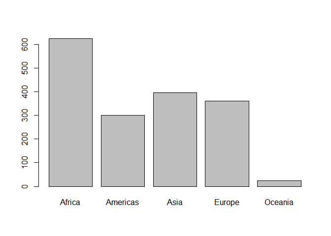

# Bring rectangular data in

```r
## load gapminder
suppressPackageStartupMessages(library(gapminder))
## load tidyverse
suppressPackageStartupMessages(library(tidyverse))
```

# Smell test the data

## Is it a data.frame, a matrix, a vector, a list?
## What is its class?


```r
## show the class of the data
class(gapminder)
```

```
## [1] "tbl_df"     "tbl"        "data.frame"
```

It is a data.frame.
It belongs to three classes: tbl_df, tbl, and data.frame

## How many variables/columns


```r
## show the number of columns
ncol(gapminder)
```

```
## [1] 6
```

## How many rows/observations?


```r
## show the number of rows
nrow(gapminder)
```

```
## [1] 1704
```

## Can you get these facts about "extent" or "size" in more than one way? Can you imagine different functions being useful in different contexts?

**For data.frame only**, we can also use `length(gapminder)` to replace `ncol(gapminder)`. We can also use `dim(gapminder)` to get the numbers of columns and rows at the same time. To be more complicated, `str(gapminder)` and `summary(gapminder)` are also possible to (indirectly) show the numbers of columns and rows

However, for `length()`, as an example, `length()` and `ncol()` will return different things if the input is a matrix. For the others, sometimes it may not be necessary to get so much redundant information.

## What data type is each variable?

```r
## show the structure of gapminder, which contains data type of each variable
str(gapminder)
```

```
## Classes 'tbl_df', 'tbl' and 'data.frame':	1704 obs. of  6 variables:
##  $ country  : Factor w/ 142 levels "Afghanistan",..: 1 1 1 1 1 1 1 1 1 1 ...
##  $ continent: Factor w/ 5 levels "Africa","Americas",..: 3 3 3 3 3 3 3 3 3 3 ...
##  $ year     : int  1952 1957 1962 1967 1972 1977 1982 1987 1992 1997 ...
##  $ lifeExp  : num  28.8 30.3 32 34 36.1 ...
##  $ pop      : int  8425333 9240934 10267083 11537966 13079460 14880372 12881816 13867957 16317921 22227415 ...
##  $ gdpPercap: num  779 821 853 836 740 ...
```

There are six variables:

- "country" as Factor
- "continent" as Factor
- "year" as int (Integer)
- "lifeExp" as num (double)
- "pop" as int (Integer)
- "gdpPercap" as num (double)

# Explore individual variables

## Explore categorical variable

There are two categorical variabels: "country" and "continent". Let's explore "country" as a categorical variable.

### What are possible values (or range, whichever is appropriate) of each variable?


```r
## print unique values in "country"
unique(gapminder$country)
```

```
##   [1] Afghanistan              Albania                 
##   [3] Algeria                  Angola                  
##   [5] Argentina                Australia               
##   [7] Austria                  Bahrain                 
##   [9] Bangladesh               Belgium                 
##  [11] Benin                    Bolivia                 
##  [13] Bosnia and Herzegovina   Botswana                
##  [15] Brazil                   Bulgaria                
##  [17] Burkina Faso             Burundi                 
##  [19] Cambodia                 Cameroon                
##  [21] Canada                   Central African Republic
##  [23] Chad                     Chile                   
##  [25] China                    Colombia                
##  [27] Comoros                  Congo, Dem. Rep.        
##  [29] Congo, Rep.              Costa Rica              
##  [31] Cote d'Ivoire            Croatia                 
##  [33] Cuba                     Czech Republic          
##  [35] Denmark                  Djibouti                
##  [37] Dominican Republic       Ecuador                 
##  [39] Egypt                    El Salvador             
##  [41] Equatorial Guinea        Eritrea                 
##  [43] Ethiopia                 Finland                 
##  [45] France                   Gabon                   
##  [47] Gambia                   Germany                 
##  [49] Ghana                    Greece                  
##  [51] Guatemala                Guinea                  
##  [53] Guinea-Bissau            Haiti                   
##  [55] Honduras                 Hong Kong, China        
##  [57] Hungary                  Iceland                 
##  [59] India                    Indonesia               
##  [61] Iran                     Iraq                    
##  [63] Ireland                  Israel                  
##  [65] Italy                    Jamaica                 
##  [67] Japan                    Jordan                  
##  [69] Kenya                    Korea, Dem. Rep.        
##  [71] Korea, Rep.              Kuwait                  
##  [73] Lebanon                  Lesotho                 
##  [75] Liberia                  Libya                   
##  [77] Madagascar               Malawi                  
##  [79] Malaysia                 Mali                    
##  [81] Mauritania               Mauritius               
##  [83] Mexico                   Mongolia                
##  [85] Montenegro               Morocco                 
##  [87] Mozambique               Myanmar                 
##  [89] Namibia                  Nepal                   
##  [91] Netherlands              New Zealand             
##  [93] Nicaragua                Niger                   
##  [95] Nigeria                  Norway                  
##  [97] Oman                     Pakistan                
##  [99] Panama                   Paraguay                
## [101] Peru                     Philippines             
## [103] Poland                   Portugal                
## [105] Puerto Rico              Reunion                 
## [107] Romania                  Rwanda                  
## [109] Sao Tome and Principe    Saudi Arabia            
## [111] Senegal                  Serbia                  
## [113] Sierra Leone             Singapore               
## [115] Slovak Republic          Slovenia                
## [117] Somalia                  South Africa            
## [119] Spain                    Sri Lanka               
## [121] Sudan                    Swaziland               
## [123] Sweden                   Switzerland             
## [125] Syria                    Taiwan                  
## [127] Tanzania                 Thailand                
## [129] Togo                     Trinidad and Tobago     
## [131] Tunisia                  Turkey                  
## [133] Uganda                   United Kingdom          
## [135] United States            Uruguay                 
## [137] Venezuela                Vietnam                 
## [139] West Bank and Gaza       Yemen, Rep.             
## [141] Zambia                   Zimbabwe                
## 142 Levels: Afghanistan Albania Algeria Angola Argentina ... Zimbabwe
```

It prints out there are 142 unique values in this column, which matches the fact that there are 142 levels in "country"

### What values are typical? What's the spread? What's the distribution? Etc., tailored to the variable at hand.


```r
## print the most frequent value(s)
tt <- table(gapminder$country)
names(tt[tt==max(tt)])
```

```
##   [1] "Afghanistan"              "Albania"                 
##   [3] "Algeria"                  "Angola"                  
##   [5] "Argentina"                "Australia"               
##   [7] "Austria"                  "Bahrain"                 
##   [9] "Bangladesh"               "Belgium"                 
##  [11] "Benin"                    "Bolivia"                 
##  [13] "Bosnia and Herzegovina"   "Botswana"                
##  [15] "Brazil"                   "Bulgaria"                
##  [17] "Burkina Faso"             "Burundi"                 
##  [19] "Cambodia"                 "Cameroon"                
##  [21] "Canada"                   "Central African Republic"
##  [23] "Chad"                     "Chile"                   
##  [25] "China"                    "Colombia"                
##  [27] "Comoros"                  "Congo, Dem. Rep."        
##  [29] "Congo, Rep."              "Costa Rica"              
##  [31] "Cote d'Ivoire"            "Croatia"                 
##  [33] "Cuba"                     "Czech Republic"          
##  [35] "Denmark"                  "Djibouti"                
##  [37] "Dominican Republic"       "Ecuador"                 
##  [39] "Egypt"                    "El Salvador"             
##  [41] "Equatorial Guinea"        "Eritrea"                 
##  [43] "Ethiopia"                 "Finland"                 
##  [45] "France"                   "Gabon"                   
##  [47] "Gambia"                   "Germany"                 
##  [49] "Ghana"                    "Greece"                  
##  [51] "Guatemala"                "Guinea"                  
##  [53] "Guinea-Bissau"            "Haiti"                   
##  [55] "Honduras"                 "Hong Kong, China"        
##  [57] "Hungary"                  "Iceland"                 
##  [59] "India"                    "Indonesia"               
##  [61] "Iran"                     "Iraq"                    
##  [63] "Ireland"                  "Israel"                  
##  [65] "Italy"                    "Jamaica"                 
##  [67] "Japan"                    "Jordan"                  
##  [69] "Kenya"                    "Korea, Dem. Rep."        
##  [71] "Korea, Rep."              "Kuwait"                  
##  [73] "Lebanon"                  "Lesotho"                 
##  [75] "Liberia"                  "Libya"                   
##  [77] "Madagascar"               "Malawi"                  
##  [79] "Malaysia"                 "Mali"                    
##  [81] "Mauritania"               "Mauritius"               
##  [83] "Mexico"                   "Mongolia"                
##  [85] "Montenegro"               "Morocco"                 
##  [87] "Mozambique"               "Myanmar"                 
##  [89] "Namibia"                  "Nepal"                   
##  [91] "Netherlands"              "New Zealand"             
##  [93] "Nicaragua"                "Niger"                   
##  [95] "Nigeria"                  "Norway"                  
##  [97] "Oman"                     "Pakistan"                
##  [99] "Panama"                   "Paraguay"                
## [101] "Peru"                     "Philippines"             
## [103] "Poland"                   "Portugal"                
## [105] "Puerto Rico"              "Reunion"                 
## [107] "Romania"                  "Rwanda"                  
## [109] "Sao Tome and Principe"    "Saudi Arabia"            
## [111] "Senegal"                  "Serbia"                  
## [113] "Sierra Leone"             "Singapore"               
## [115] "Slovak Republic"          "Slovenia"                
## [117] "Somalia"                  "South Africa"            
## [119] "Spain"                    "Sri Lanka"               
## [121] "Sudan"                    "Swaziland"               
## [123] "Sweden"                   "Switzerland"             
## [125] "Syria"                    "Taiwan"                  
## [127] "Tanzania"                 "Thailand"                
## [129] "Togo"                     "Trinidad and Tobago"     
## [131] "Tunisia"                  "Turkey"                  
## [133] "Uganda"                   "United Kingdom"          
## [135] "United States"            "Uruguay"                 
## [137] "Venezuela"                "Vietnam"                 
## [139] "West Bank and Gaza"       "Yemen, Rep."             
## [141] "Zambia"                   "Zimbabwe"
```


```r
## print the frequency of each unique value
summary(gapminder$country)  %>% 
  knitr::kable(col.names=c("frequency"))
```

                            frequency
-------------------------  ----------
Afghanistan                        12
Albania                            12
Algeria                            12
Angola                             12
Argentina                          12
Australia                          12
Austria                            12
Bahrain                            12
Bangladesh                         12
Belgium                            12
Benin                              12
Bolivia                            12
Bosnia and Herzegovina             12
Botswana                           12
Brazil                             12
Bulgaria                           12
Burkina Faso                       12
Burundi                            12
Cambodia                           12
Cameroon                           12
Canada                             12
Central African Republic           12
Chad                               12
Chile                              12
China                              12
Colombia                           12
Comoros                            12
Congo, Dem. Rep.                   12
Congo, Rep.                        12
Costa Rica                         12
Cote d'Ivoire                      12
Croatia                            12
Cuba                               12
Czech Republic                     12
Denmark                            12
Djibouti                           12
Dominican Republic                 12
Ecuador                            12
Egypt                              12
El Salvador                        12
Equatorial Guinea                  12
Eritrea                            12
Ethiopia                           12
Finland                            12
France                             12
Gabon                              12
Gambia                             12
Germany                            12
Ghana                              12
Greece                             12
Guatemala                          12
Guinea                             12
Guinea-Bissau                      12
Haiti                              12
Honduras                           12
Hong Kong, China                   12
Hungary                            12
Iceland                            12
India                              12
Indonesia                          12
Iran                               12
Iraq                               12
Ireland                            12
Israel                             12
Italy                              12
Jamaica                            12
Japan                              12
Jordan                             12
Kenya                              12
Korea, Dem. Rep.                   12
Korea, Rep.                        12
Kuwait                             12
Lebanon                            12
Lesotho                            12
Liberia                            12
Libya                              12
Madagascar                         12
Malawi                             12
Malaysia                           12
Mali                               12
Mauritania                         12
Mauritius                          12
Mexico                             12
Mongolia                           12
Montenegro                         12
Morocco                            12
Mozambique                         12
Myanmar                            12
Namibia                            12
Nepal                              12
Netherlands                        12
New Zealand                        12
Nicaragua                          12
Niger                              12
Nigeria                            12
Norway                             12
Oman                               12
Pakistan                           12
Panama                             12
(Other)                           516

It seems like every unique value in "country" has the same frequency, which is 12.


```r
## print the barplot of each unique value
barplot(table(gapminder$country))
```

<!-- -->

It is not surprise that when we plot the frequency of every unique value in "country", each bar appears to be the same.

Therefore, we explore "continent" to check if the R code is correct.


```r
## print the most frequent value(s)
tt <- table(gapminder$continent)
names(tt[tt==max(tt)])
```

```
## [1] "Africa"
```


```r
## print the frequency of each unique value
summary(gapminder$continent)  %>% 
  knitr::kable(col.names=c("frequency"))
```

            frequency
---------  ----------
Africa            624
Americas          300
Asia              396
Europe            360
Oceania            24

So the most frequent (typical) value in "continent" is "Africa".


```r
## print the barplot of each unique value
barplot(table(gapminder$continent))
```

<!-- -->

## Explore quantitative variable

There are four quantitative variabels: "year", "lifeExp", "pop" and "gdpPercap". Let's explore "year" as a quantitative variable.

### What are possible values (or range, whichever is appropriate) of each variable?


```r
## print the range of "year"
range(gapminder$year)
```

```
## [1] 1952 2007
```

### What values are typical? What's the spread? What's the distribution? Etc., tailored to the variable at hand.


```r
## print the most frequent value(s)
tt <- table(gapminder$year)
names(tt[tt==max(tt)])
```

```
##  [1] "1952" "1957" "1962" "1967" "1972" "1977" "1982" "1987" "1992" "1997"
## [11] "2002" "2007"
```


```r
## print the frequency of each unique value
table(gapminder$year) %>% 
  knitr::kable(col.names=c("year", "frequency"))
```


year    frequency
-----  ----------
1952          142
1957          142
1962          142
1967          142
1972          142
1977          142
1982          142
1987          142
1992          142
1997          142
2002          142
2007          142

It seems like every unique value in "year" has the same frequency, which is 142.


```r
## print the barplot of each unique value
barplot(table(gapminder$year))
```

<!-- -->

Again, each bar in the barplot is the same.

Therefore, we explore "lifeExp" to check if the R code is correct.


```r
## print the most frequent value(s)
tt <- table(gapminder$lifeExp)
names(tt[tt==max(tt)])
```

```
## [1] "69.39"
```


```r
## print the frequency of the most frequent value
tt[tt==max(tt)] %>% 
  knitr::kable(col.names=c("frequency"))
```

         frequency
------  ----------
69.39            4

The most frequent value is 69.39, with 4 appearances.


```r
## print the barplot of each unique value
barplot(table(gapminder$lifeExp))
```

<!-- -->

# Explore various plot types
# Use `filter()`, `select()` and `%>%`

I would like to combine there two sections together to print some plots using piping and dplyr functions.

## A scatterplot of two quantitative variables.

Let's show the population (in log) in different years.


```r
sp <- gapminder %>% 
  # year as x axis and pop as y axis
  ggplot(aes(x=year, y=pop)) +
  # scale y axis by log10
  scale_y_log10() +
  # make it a scatterplot, and add transparancy
  geom_point(alpha=0.1)
# display scatterplot
sp
```

<!-- -->

Let's also do a version with jitter.


```r
gapminder %>% 
  # year as x axis and pop as y axis
  ggplot(aes(x=year, y=pop)) +
  # scale y axis by log10
  scale_y_log10() +
  # make it a Jitter plot
  geom_jitter() +
  # make different size according to pop, and add color for different continents
  aes(size=pop, color=continent) +
  # scale the size so it is more readable
  scale_size_area()
```

<!-- -->


We then use facetting to show the trends in different continents. To make it clearer, we apply colors on different continents.


```r
sp +
  # show colors
  aes(color=continent) + 
  # facetting by continent
  facet_wrap(~ continent)
```

<!-- -->

Let's select a single country (e.g. Canada), and show its trend of population throughout the years.


```r
gapminder %>% 
  # filter country as Canada
  filter(country == "Canada") %>% 
  # year as x axis and pop as y axis
  ggplot(aes(x=year, y=pop)) +
  # scale y axis by log10
  scale_y_log10() +
  # make it a scatterplot
  geom_point() +
  # try to draw a regression curve
  geom_smooth(method="lm", se=FALSE)
```

<!-- -->


Let's see the difference of regression curve compared to line plot.


```r
gapminder %>% 
  # filter country as Canada
  filter(country == "Canada") %>% 
  # year as x axis and pop as y axis
  ggplot(aes(x=year, y=pop)) +
  # scale y axis by log10
  scale_y_log10() +
  # make it a lineplot with points
  geom_point() +
  geom_line()
```

<!-- -->

The line plot only connects all data points instead of find out the relationship.

## A plot of one quantitative variable. Maybe a histogram or densityplot or frequency polygon.

In this section, we use "lifeExp" as the quantitative variable under analysis.

### A histogram of "lifeExp"


```r
gapminder %>% 
  # lifeExp as x axis
  ggplot(aes(x=lifeExp)) +
  # make it a histogram (we fill it with color by continents, and this is an example of overplotting)
  geom_histogram(bins=50, aes(fill=continent))
```

<!-- -->

Let's try to show it for different continents and years.


```r
gapminder %>%
  # to make it look better, remove Oceania and filter only a few years
  filter(continent!="Oceania", year>=1990) %>% 
  # lifeExp as x axis
  ggplot(aes(x=lifeExp)) +
  # make it a histogram
  geom_histogram(bins=50) +
  # facetting
  facet_grid(year ~ continent, scales="free_x")
```

<!-- -->


### A densityplot of "lifeExp"


```r
gapminder %>% 
  # lifeExp as x axis
  ggplot(aes(x=lifeExp)) +
  # make it a densityplot
  geom_density(fill="grey")
```

<!-- -->

Let's combine histogram and densityplot together

```r
gapminder %>% 
  # lifeExp as x axis
  ggplot(aes(x=lifeExp)) +
  # make it a histogram, also scale it similar to densityplot
  geom_histogram(bins=50, aes(y=..density..), color="black") +
  # make it a densityplot
  geom_density()
```

<!-- -->

### A frequency polygon of "lifeExp"

```r
gapminder %>% 
  # lifeExp as x axis
  ggplot(aes(x=lifeExp)) +
  # make it a frequency polygon
  geom_freqpoly(bins=30)
```

<!-- -->

## A plot of one quantitative variable and one categorical. Maybe boxplots for several continents or countries.

Let's show a boxplot for GDP in different continents. Though a `select()` does not affect the result, we use it just for a demonstration.


```r
gapminder %>% 
  # select gdpPercap and continent columns
  select(gdpPercap, continent) %>% 
  # continent as x axis and gdpPercap as y axis
  ggplot(aes(x=continent, y=gdpPercap)) +
  # scale y by log10, so the result is better
  scale_y_log10() +
  # make it a boxplot
  geom_boxplot()
```

<!-- -->

Let's also make a violin plot.


```r
gapminder %>% 
  # select gdpPercap and continent columns
  select(gdpPercap, continent) %>% 
  # continent as x axis and gdpPercap as y axis
  ggplot(aes(x=continent, y=gdpPercap)) +
  # scale y by log10, so the result is better
  scale_y_log10() +
  # make it a violin plot
  geom_violin(color="red", fill="red", alpha=0.1)
```

<!-- -->

# But I want to do more!

## Evaluate this code and describe the result.

Let's run the code first to see what happens.

```r
filter(gapminder, country == c("Rwanda", "Afghanistan")) %>% 
  knitr::kable()
```


country       continent    year   lifeExp        pop   gdpPercap
------------  ----------  -----  --------  ---------  ----------
Afghanistan   Asia         1957    30.332    9240934    820.8530
Afghanistan   Asia         1967    34.020   11537966    836.1971
Afghanistan   Asia         1977    38.438   14880372    786.1134
Afghanistan   Asia         1987    40.822   13867957    852.3959
Afghanistan   Asia         1997    41.763   22227415    635.3414
Afghanistan   Asia         2007    43.828   31889923    974.5803
Rwanda        Africa       1952    40.000    2534927    493.3239
Rwanda        Africa       1962    43.000    3051242    597.4731
Rwanda        Africa       1972    44.600    3992121    590.5807
Rwanda        Africa       1982    46.218    5507565    881.5706
Rwanda        Africa       1992    23.599    7290203    737.0686
Rwanda        Africa       2002    43.413    7852401    785.6538

Here is a right version, and let's make a comparison.

```r
filter(gapminder, country %in% c("Rwanda", "Afghanistan"))  %>% 
  knitr::kable()
```


country       continent    year   lifeExp        pop   gdpPercap
------------  ----------  -----  --------  ---------  ----------
Afghanistan   Asia         1952    28.801    8425333    779.4453
Afghanistan   Asia         1957    30.332    9240934    820.8530
Afghanistan   Asia         1962    31.997   10267083    853.1007
Afghanistan   Asia         1967    34.020   11537966    836.1971
Afghanistan   Asia         1972    36.088   13079460    739.9811
Afghanistan   Asia         1977    38.438   14880372    786.1134
Afghanistan   Asia         1982    39.854   12881816    978.0114
Afghanistan   Asia         1987    40.822   13867957    852.3959
Afghanistan   Asia         1992    41.674   16317921    649.3414
Afghanistan   Asia         1997    41.763   22227415    635.3414
Afghanistan   Asia         2002    42.129   25268405    726.7341
Afghanistan   Asia         2007    43.828   31889923    974.5803
Rwanda        Africa       1952    40.000    2534927    493.3239
Rwanda        Africa       1957    41.500    2822082    540.2894
Rwanda        Africa       1962    43.000    3051242    597.4731
Rwanda        Africa       1967    44.100    3451079    510.9637
Rwanda        Africa       1972    44.600    3992121    590.5807
Rwanda        Africa       1977    45.000    4657072    670.0806
Rwanda        Africa       1982    46.218    5507565    881.5706
Rwanda        Africa       1987    44.020    6349365    847.9912
Rwanda        Africa       1992    23.599    7290203    737.0686
Rwanda        Africa       1997    36.087    7212583    589.9445
Rwanda        Africa       2002    43.413    7852401    785.6538
Rwanda        Africa       2007    46.242    8860588    863.0885

The second one shows more results. That is because using `==`, country needs to be strictly equaled to a list with two string "Rwanda" and "Afghanistan", which does not match the data frame and leads to wrong results. While using `%in%`, country only needs to be either one of the two strings, and the results are complete.

## Use more of the dplyr functions for operating on a single table.

### `arrange()`

We can use `arrange()` to re-order rows.


```r
gapminder %>% 
  # filter some records to make the resultant table look better
  filter(pop >= 200000000) %>% 
  # re-order rows, first by continent, then country, then year
  arrange(continent, country, year) %>% 
  # re-order columns to first show continent then country
  select(continent, country, everything())  %>% 
  # display table
  knitr::kable()
```


continent   country          year    lifeExp          pop    gdpPercap
----------  --------------  -----  ---------  -----------  -----------
Americas    United States    1972   71.34000    209896000   21806.0359
Americas    United States    1977   73.38000    220239000   24072.6321
Americas    United States    1982   74.65000    232187835   25009.5591
Americas    United States    1987   75.02000    242803533   29884.3504
Americas    United States    1992   76.09000    256894189   32003.9322
Americas    United States    1997   76.81000    272911760   35767.4330
Americas    United States    2002   77.31000    287675526   39097.0995
Americas    United States    2007   78.24200    301139947   42951.6531
Asia        China            1952   44.00000    556263527     400.4486
Asia        China            1957   50.54896    637408000     575.9870
Asia        China            1962   44.50136    665770000     487.6740
Asia        China            1967   58.38112    754550000     612.7057
Asia        China            1972   63.11888    862030000     676.9001
Asia        China            1977   63.96736    943455000     741.2375
Asia        China            1982   65.52500   1000281000     962.4214
Asia        China            1987   67.27400   1084035000    1378.9040
Asia        China            1992   68.69000   1164970000    1655.7842
Asia        China            1997   70.42600   1230075000    2289.2341
Asia        China            2002   72.02800   1280400000    3119.2809
Asia        China            2007   72.96100   1318683096    4959.1149
Asia        India            1952   37.37300    372000000     546.5657
Asia        India            1957   40.24900    409000000     590.0620
Asia        India            1962   43.60500    454000000     658.3472
Asia        India            1967   47.19300    506000000     700.7706
Asia        India            1972   50.65100    567000000     724.0325
Asia        India            1977   54.20800    634000000     813.3373
Asia        India            1982   56.59600    708000000     855.7235
Asia        India            1987   58.55300    788000000     976.5127
Asia        India            1992   60.22300    872000000    1164.4068
Asia        India            1997   61.76500    959000000    1458.8174
Asia        India            2002   62.87900   1034172547    1746.7695
Asia        India            2007   64.69800   1110396331    2452.2104
Asia        Indonesia        2002   68.58800    211060000    2873.9129
Asia        Indonesia        2007   70.65000    223547000    3540.6516

### `mutate()`

We can use `mutate()` to create new columns. For example, we can calulate log10 of "lifeExp", and show "pop" in million.


```r
gapminder %>% 
  # filter some records to make the resultant table look better
  filter(continent == "Oceania") %>% 
  # mutate lifeExp to lifeExpInLog10 and pop to popInMillion
  mutate(
    lifeExpInLog10 = log10(lifeExp),
    popInMillion = pop / 1000000
  ) %>% 
  # delete original columns
  select(-lifeExp, -pop)  %>% 
  # display table
  knitr::kable()
```


country       continent    year   gdpPercap   lifeExpInLog10   popInMillion
------------  ----------  -----  ----------  ---------------  -------------
Australia     Oceania      1952    10039.60         1.839604       8.691212
Australia     Oceania      1957    10949.65         1.847141       9.712569
Australia     Oceania      1962    12217.23         1.850830      10.794968
Australia     Oceania      1967    14526.12         1.851870      11.872264
Australia     Oceania      1972    16788.63         1.856910      13.177000
Australia     Oceania      1977    18334.20         1.866228      14.074100
Australia     Oceania      1982    19477.01         1.873553      15.184200
Australia     Oceania      1987    21888.89         1.882638      16.257249
Australia     Oceania      1992    23424.77         1.889638      17.481977
Australia     Oceania      1997    26997.94         1.896691      18.565243
Australia     Oceania      2002    30687.75         1.905094      19.546792
Australia     Oceania      2007    34435.37         1.909743      20.434176
New Zealand   Oceania      1952    10556.58         1.841297       1.994794
New Zealand   Oceania      1957    12247.40         1.846708       2.229407
New Zealand   Oceania      1962    13175.68         1.852724       2.488550
New Zealand   Oceania      1967    14463.92         1.854427       2.728150
New Zealand   Oceania      1972    16046.04         1.856669       2.929100
New Zealand   Oceania      1977    16233.72         1.858658       3.164900
New Zealand   Oceania      1982    17632.41         1.868292       3.210650
New Zealand   Oceania      1987    19007.19         1.871106       3.317166
New Zealand   Oceania      1992    18363.32         1.882695       3.437674
New Zealand   Oceania      1997    21050.41         1.889582       3.676187
New Zealand   Oceania      2002    23189.80         1.898231       3.908037
New Zealand   Oceania      2007    25185.01         1.904196       4.115771

### `summarise()` and `group_by()`

We can use `summarise()` to calculate statistical summaries like mean values. We can also use `group_by()` to group same variables like continents.


```r
gapminder %>% 
  # group by continent
  group_by(continent) %>% 
  # calculate summaries
  summarize(
    avg_gdpPercap = mean(gdpPercap),
    max_lifeExp = max(lifeExp),
    min_pop = min(pop),
    total = n()
  ) %>%
  # display table
  knitr::kable()
```


continent    avg_gdpPercap   max_lifeExp   min_pop   total
----------  --------------  ------------  --------  ------
Africa            2193.755        76.442     60011     624
Americas          7136.110        80.653    662850     300
Asia              7902.150        82.603    120447     396
Europe           14469.476        81.757    147962     360
Oceania          18621.609        81.235   1994794      24

